# 🚀 Git Installation Guide

This is a complete step-by-step guide to install Git on your machine.

If you do not have Git installed yet, follow this guide carefully and complete all the steps.

If you already have Git installed, you can skip this file and move on to the next onboarding guide in the repository.

---

> ⚠️ Note:
>
> This guide demonstrates how to install Git on a Windows machine.
>
> If you are using macOS or Linux, please refer to the official Git installation instructions below:
>
> - macOS: https://git-scm.com/downloads/mac
> - Linux/Unix: https://git-scm.com/downloads/linux
>
> The installation screens and steps may differ from those shown in this guide.

---

## 1. Open Git Download Page

Copy and paste the following link into your browser:

https://git-scm.com/downloads

---

## 2. Select Your Operating System

You will see a page like this.

Choose the operating system based on your computer.

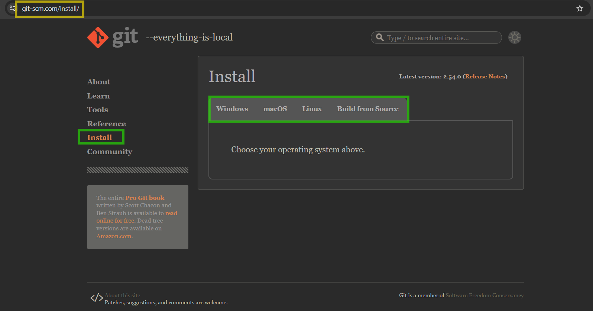

---

## 3. Download Git for Windows

Select your operating system on the page.

This guide is for Windows users.

Click on:

**Git for Windows / x64 Setup (Standalone Installer)**

Choose the option that is compatible with your system.


---

## 4. Choose Download Location

After clicking on **Git for Windows / x64 Setup (Standalone Installer)**, your browser will ask where to save the file.

Choose the **Downloads** folder on your computer and save the file there.


---

## 5. Open the Setup File

Go to your **Downloads** folder.

Find the Git setup file you just downloaded.

Double-click on the file to start the installation process.

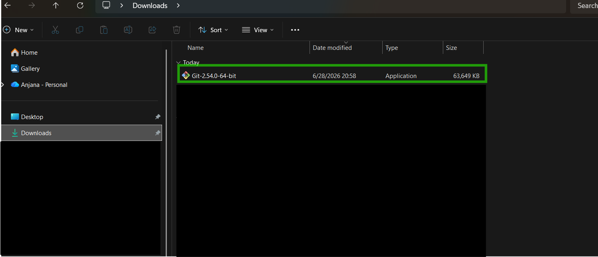

---

## 6. Read the License Agreement

Review the license agreement and click **Next** to continue.

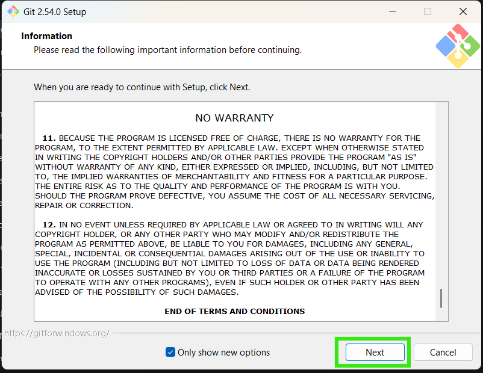

---

## 7. Select Components

Select the components and click **Next**.

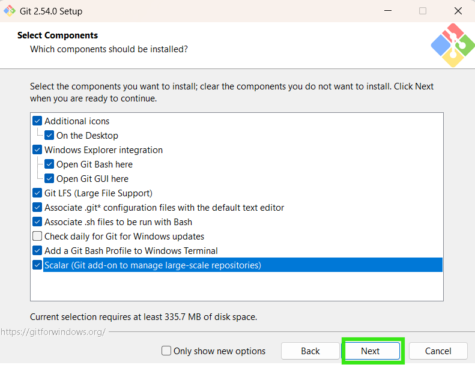

---

## 8. Select default editor

- Click on drop down menu
- Select **Visual Studio Code** as the default editor
- Click **Next**.

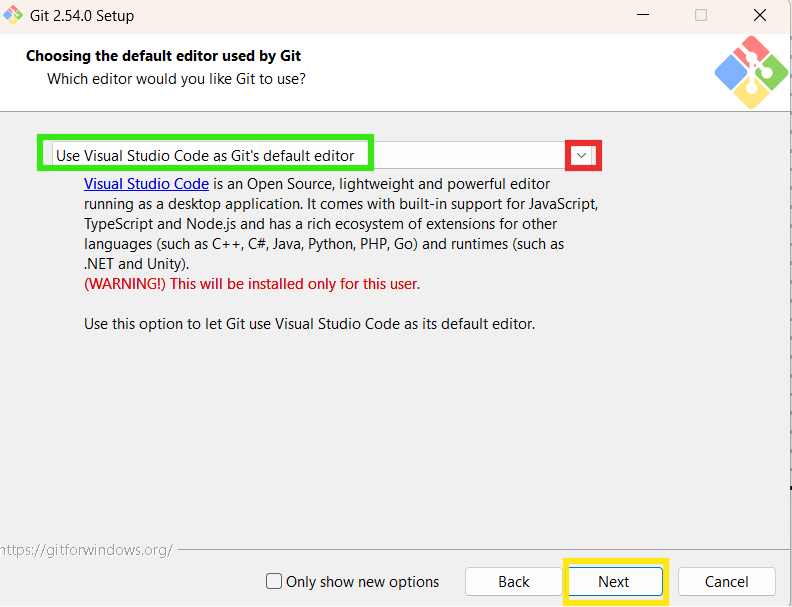

---

## 9. Set the Default Branch Name

Select **Override the default branch name for new repositories** and set the branch name to:

**main**

Then click **Next**.

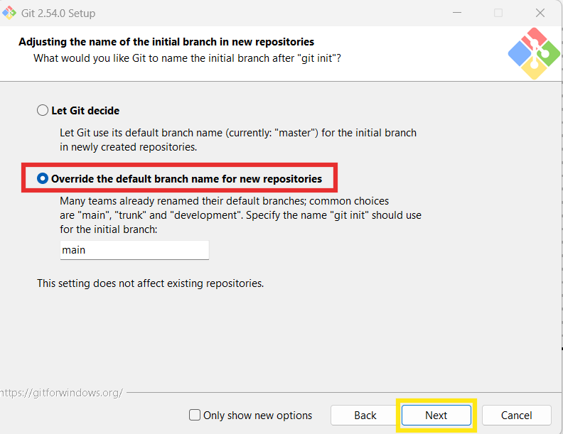

---

## 10. Configure the Git PATH

Select:

**Git from the command line and also from 3rd-party software**

Then click **Next**.

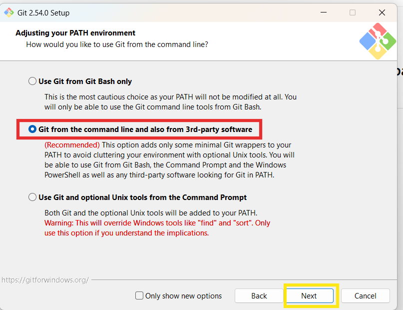

---

## 11. Choose the SSH Executable

Select:

**Use bundled OpenSSH**

Then click **Next**.

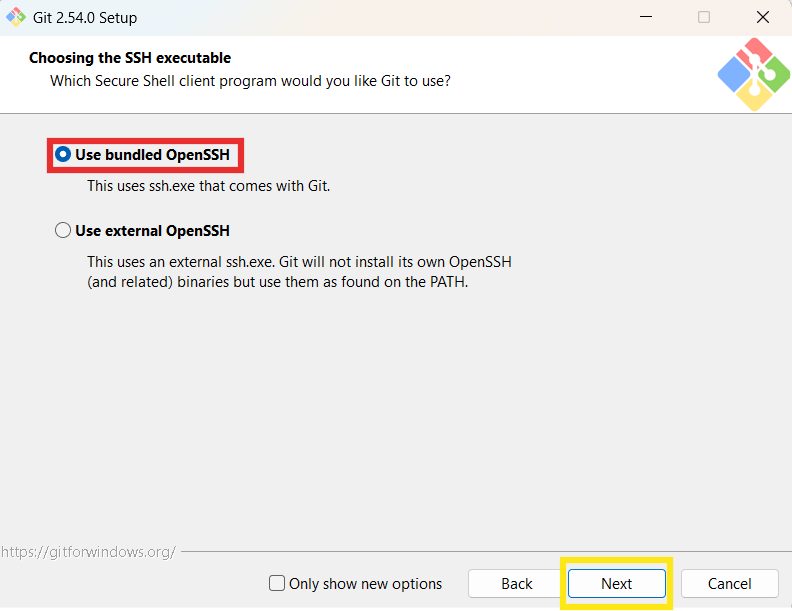

---

## 12. Choose the HTTPS Transport Backend

Select:

**Use the OpenSSL library**

Then click **Next**.

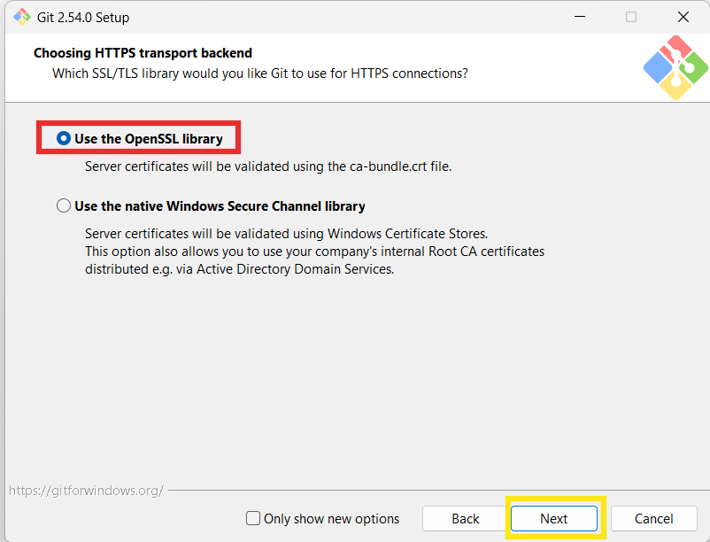

---

## 13. Configure Line Ending Conversions

Select:

**Checkout Windows-style, commit Unix-style line endings**

Then click **Next**.

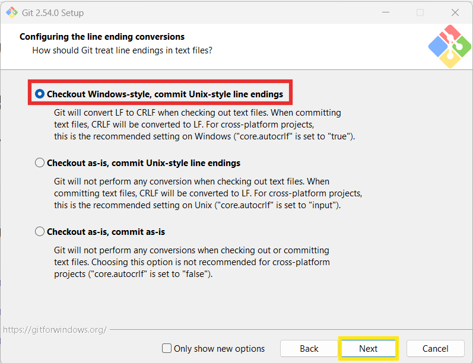

---

## 14. Configure the Terminal Emulator

Select:

**Use MinTTY (the default terminal of MSYS2)**

Then click **Next**.

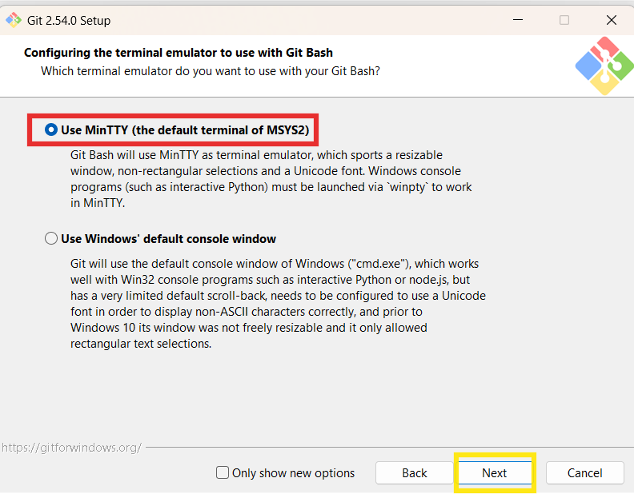

---

## 15. Configure the Default Behavior of Git Pull

Select:

**Fast-forward or merge**

Then click **Next**.

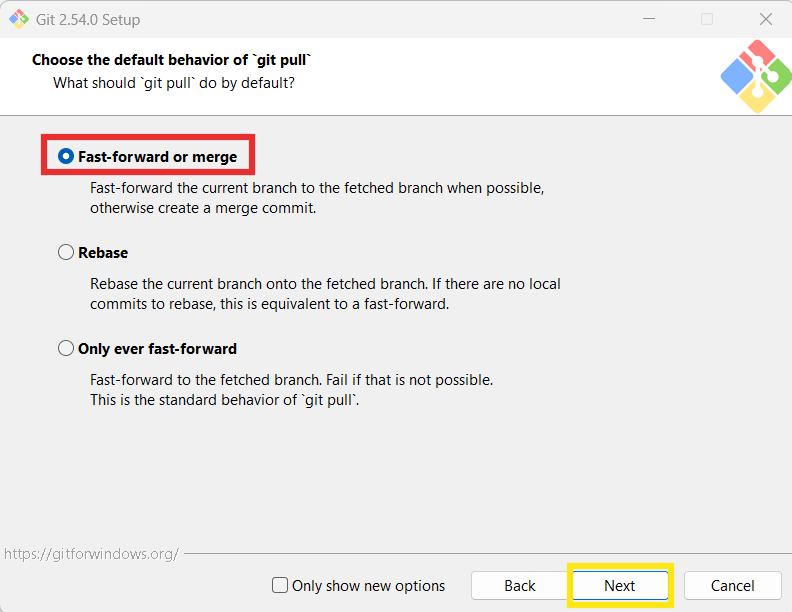

---

## 16. Configure the Credential Helper

Select:

**Git Credential Manager**

Then click **Next**.

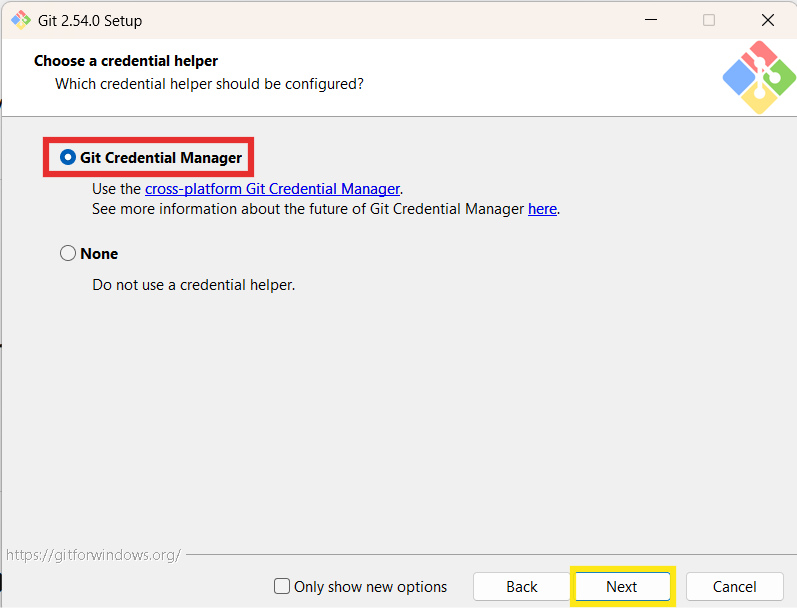

---

## 17. Configure Additional Options

Leave **Enable file system caching** checked and click **Next**.

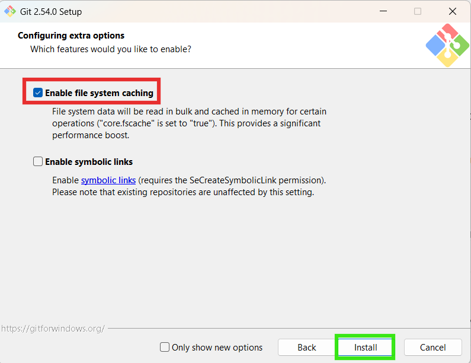

---

## 18. Complete the Installation

Keep **Launch Git Bash** selected and click **Finish**.

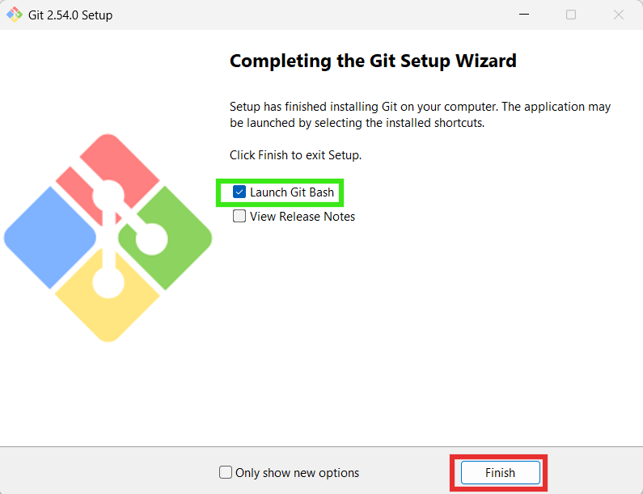

---

## 19. Git Bash Opens

After the installation is complete, Git Bash will open automatically.

This is the terminal you will use to run Git commands.

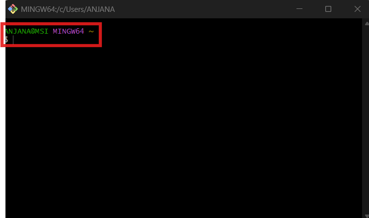

---

## 20. Verify Git Installation

Run the following command in Git Bash:

```bash
git --version
```

If Git is installed correctly, you will see a version number displayed.

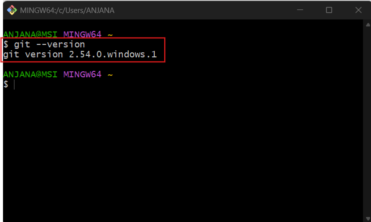

---

# 🎯 You’re Done!

If you followed all the steps, Git has been installed successfully on your machine.

You are now ready to continue with the next onboarding guide in this repository.

Happy learning! 🚀


