# 🚀 VS Code Installation & GitHub Setup Guide

This is a complete step-by-step guide to install Visual Studio Code (VS Code) and connect it with your GitHub account.

---

If you do not have VS Code installed or have not connected it with GitHub yet, follow this guide carefully and complete all the steps.

If you have already completed VS Code installation and GitHub setup, you can skip this file and move on to the next onboarding guide in the repository.

---

## 1. Open VS Code Download Page

Open your web browser and copy-paste the following link:

https://code.visualstudio.com/download

This will take you to the official Visual Studio Code download page.

---

## 2. Download VS Code

You will now see download options for different operating systems (Windows, macOS, Linux).

Select the installer according to your **operating system** and your **system compatibility**.

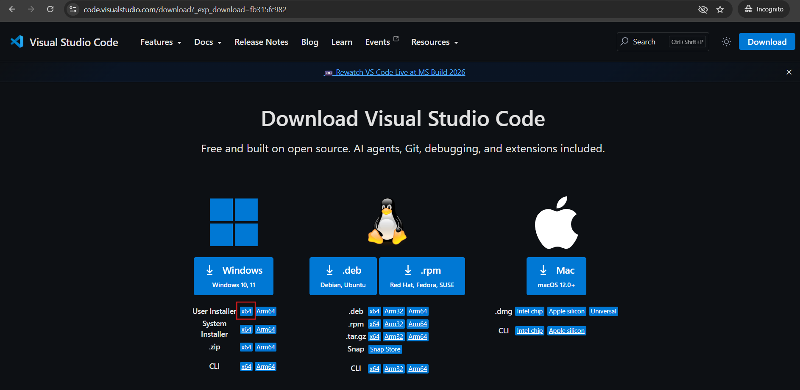

---

⚠️ **Note:**

This guide demonstrates the installation process for **Windows users only**.

If you are using macOS or Linux, please select the appropriate installer for your system from the same page. The installation steps may look different depending on your operating system.

---

## 3. Choose Download Location

After clicking the link to download, your browser will ask where to save the file.

Select the **Downloads** folder on your computer and click **Save**.

This will make it easy to find the file later when installing VS Code.

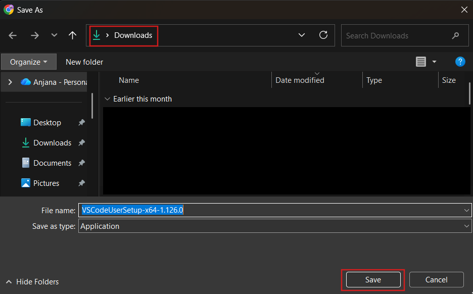

---

## 5. Open the Setup File

Go to your **Downloads** folder.

Find the VS Code setup file you just downloaded.

Double-click on the file to start the installation process.

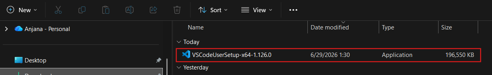

---

## 6. Accept the License Agreement

When the license agreement appears:

- Tick **I accept the agreement**
- Click **Next** to continue

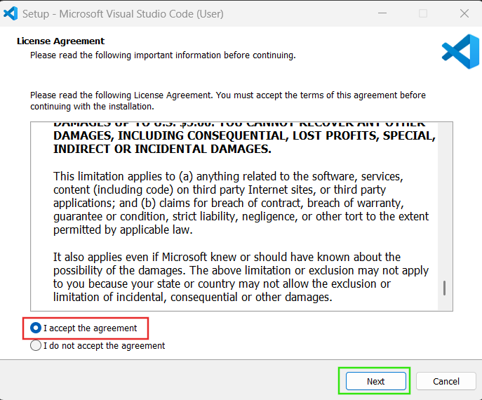

---

## 7. Select Additional Tasks

In this step, select the following options:

### Additional Icons:
- ✔ Create a desktop icon  

### Other:
- ✔ Add "Open with Code" action to Windows Explorer file context menu  
- ✔ Add "Open with Code" action to Windows Explorer directory context menu  
- ✔ Register Code as an editor for supported file types  
- ✔ Add to PATH (requires shell restart)  

Then click **Next**.

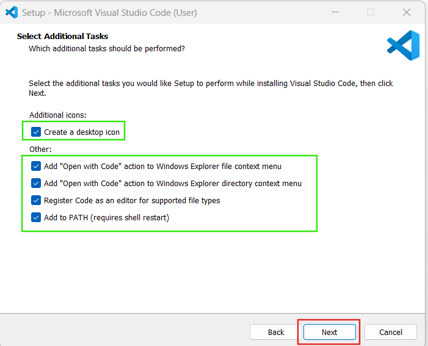

---

## 8. Start Installation

In the final setup window, click **Install** to begin the installation process.

Wait for the installation to complete.

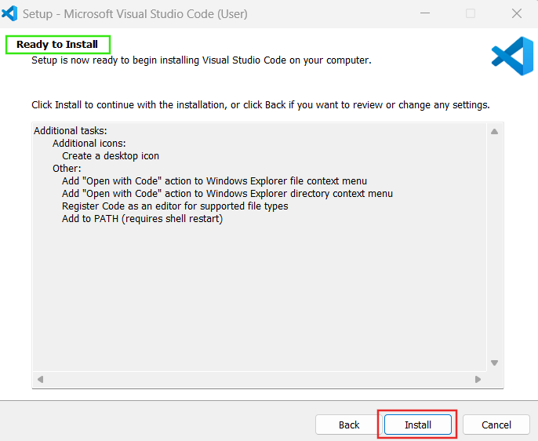

---

## 9. Finish Installation

In the final window:

- ✔ Check **Launch Visual Studio Code**
- ✔ Click **Finish** to complete the setup.

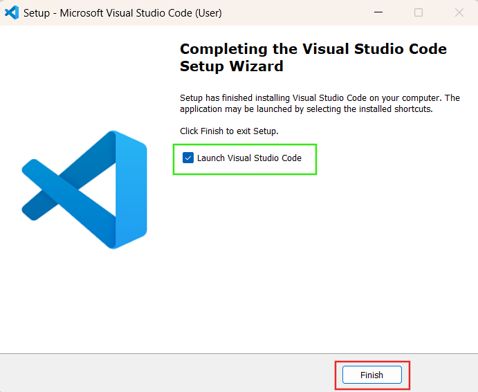

---

## 10. VS Code Successfully Opened

After clicking **Finish**, Visual Studio Code will automatically open.

You will see the VS Code welcome window like this:

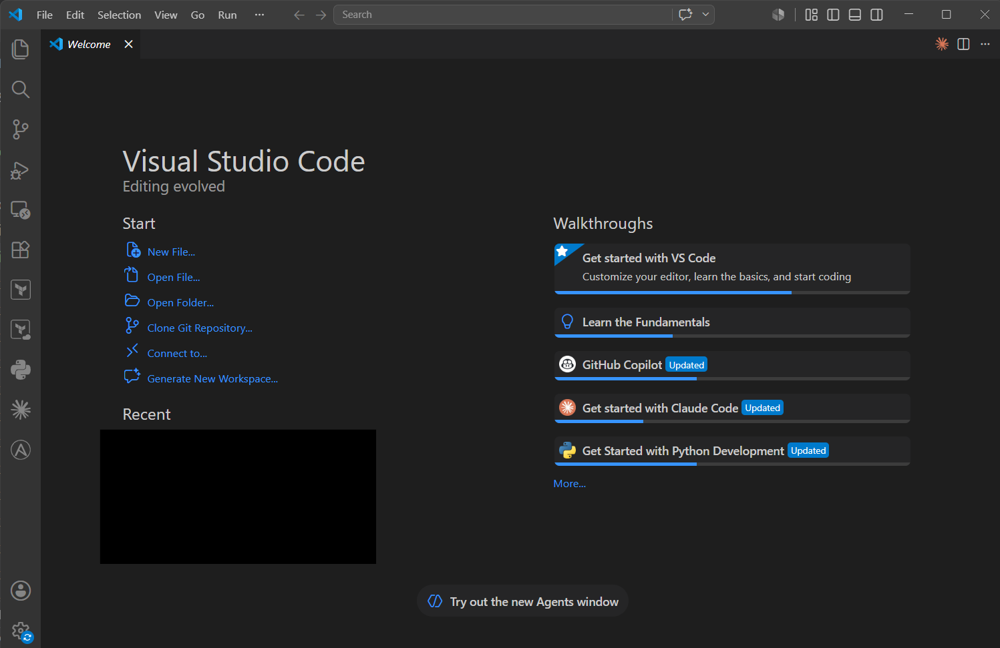

This confirms that VS Code has been installed successfully.

---

## 🔗 Connect VS Code with GitHub Account

Follow these steps to connect Visual Studio Code with your GitHub account.

---

### 1. Open Sign-In Option

In Visual Studio Code, click the **Sign in** option from the **top-right corner**.

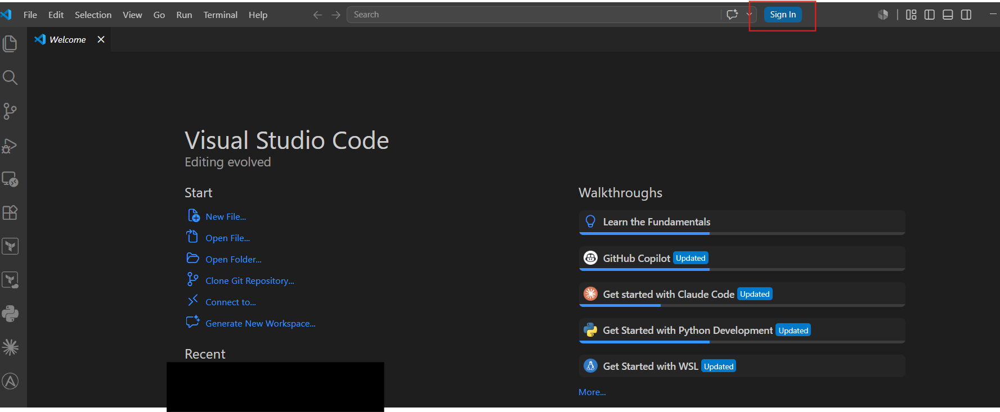

---

### 2. Choose GitHub Sign-In

A popup window will appear.

Select:

👉 **Continue with GitHub**

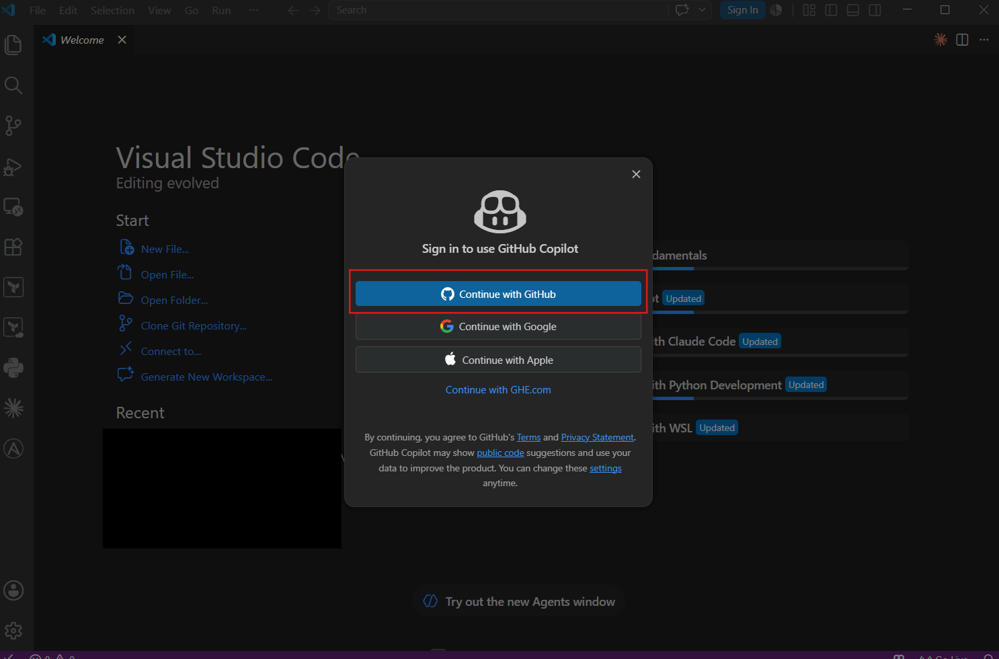

---

### 3. Authorize in Browser

You will be redirected to your browser.

* Log in to your GitHub account (if not already logged in)
* Click **Continue** to authorize Visual Studio Code

---

### 4. Open VS Code

After authorization, a popup will appear asking to open Visual Studio Code.

* Click **Open Visual Studio Code**

---

### 5. Confirm in VS Code

You will be redirected back to VS Code.

Click the **Profile icon (👤)**

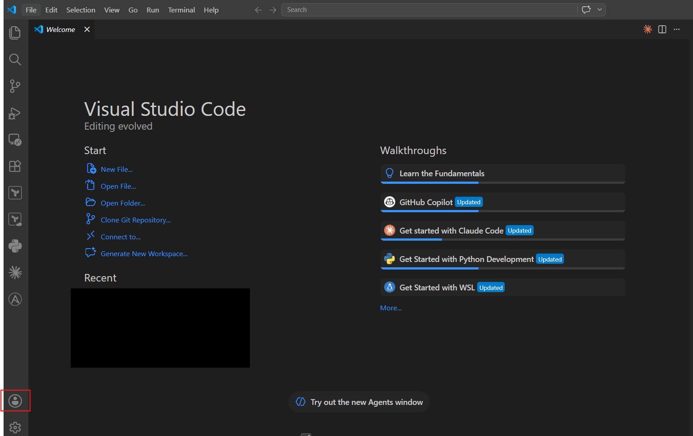

---

### 6. Verify Connection

You should now see your **GitHub account name** displayed.

✔ This confirms that VS Code is successfully connected to GitHub

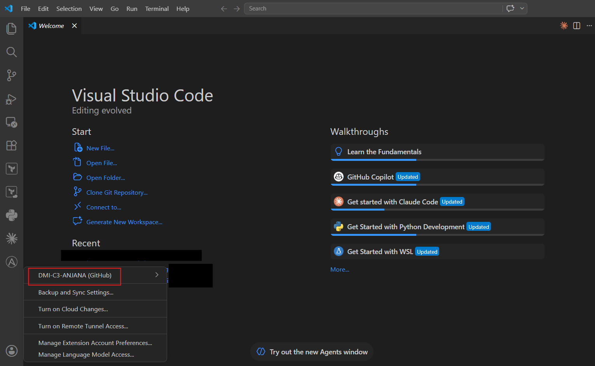

---

# 🎉 You’re Done!

If you followed all the steps, Visual Studio Code is now successfully connected to your GitHub account.

You are now ready to continue with the next onboarding guide in this repository.

Happy learning! 🚀

