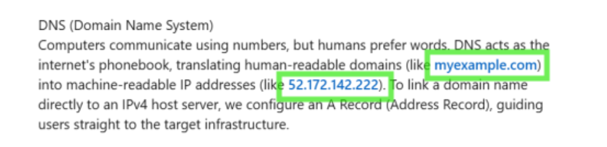
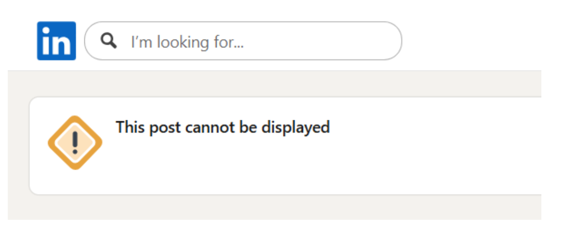
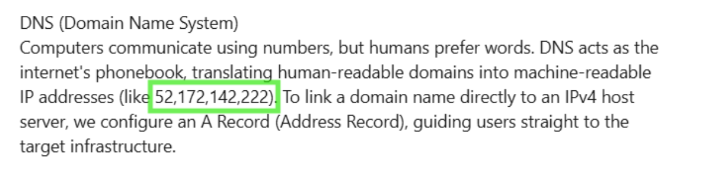
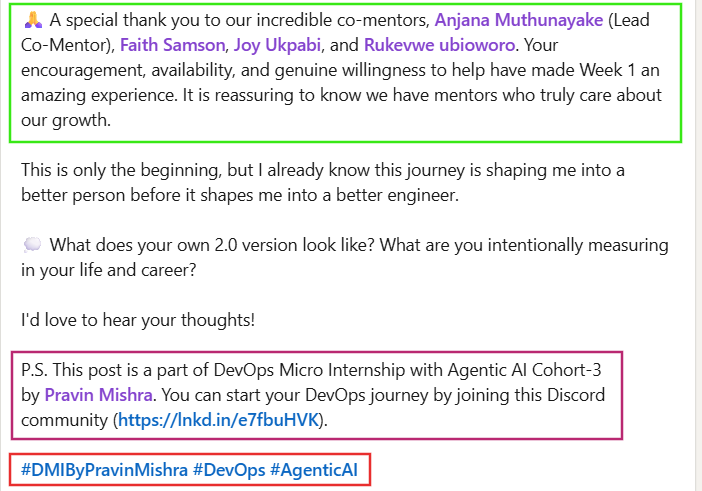

# 📌 How to Write LinkedIn Posts (DevOps Micro Internship – Cohort 3)

This guide will help you write professional LinkedIn posts for your assignments, tag mentors correctly, and avoid common mistakes.

---

## ✍️ LinkedIn Post Guidelines (Follow Assignment Template)

For each weekly assignment, your LinkedIn post **must be created based on the instructions provided in the assignment template**.

The template already specifies:

* What content should be included in your post
* Which screenshots need to be attached
* Any required formatting or points to cover

👉 Please ensure you follow the template instructions for each assignment.

---

## 🏷️ Tagging Mentors (Important)

You must tag **Pravin Mishra**, your **Lead Co-Mentor** and your **Group Co-Mentors** in every post.

### Pravin Miahra

* Pravin Mishra [Linkedin profile](https://www.linkedin.com/in/pravin-mishra-aws-trainer/)

### 👨‍🏫 Lead Co-Mentor

* Anjana Muthunayake [Linkedin profile](https://www.linkedin.com/in/anjana-muthunayake/)

---

### 👥 Group Co-Mentors

**Group 1**

* Nkechi Ahanonye [Linkedin profile](https://www.linkedin.com/in/nkechiahanonye/)
* Tanisha Borana [Linkedin profile](https://www.linkedin.com/in/tanisha-borana-552797233/)
* Anuradha Iyer [Linkedin profile](https://www.linkedin.com/in/iyeranuradha/)

**Group 2**

* Anjana Muthunayake [Linkedin profile](https://www.linkedin.com/in/anjana-muthunayake/)
* Faith Samson [Linkedin profile](https://www.linkedin.com/in/faith-samson-nigo/)
* Joy Ukpabi [Linkedin profile](https://www.linkedin.com/in/joyukpabi/)
* Rukevwe Ubioworo [Linkedin profile](https://www.linkedin.com/in/ubioworoisaiah/)

**Group 3**

* Bhupendra Bhati [Linkedin profile](https://www.linkedin.com/in/bhupendrabhati/)
* Ranbir Kaur [Linkedin profile](https://www.linkedin.com/in/ranbirkaur/)
* Greg Odi [Linkedin profile](https://www.linkedin.com/in/gregodi/)

---

## ⚠️ Common Mistakes to Avoid

### ❌ 1. Using IP addresses in posts

Examples:

* 127.0.0.1
* 54.20.30.2

### ❌ 2. Using fake domain-style text

Example:

* myexample.com

### ⚠️ Why avoid this?

LinkedIn may treat them as real links, which can:

* Break formatting
* Hide parts of your post
* Show errors like “This post cannot be displayed.”

### ✅ If you must show them:

Use commas instead of dots:

* 127,0,0,1
* myexample,com

---

## 🧾 Mandatory Ending (P.S. Section & Hashtags)

Every LinkedIn post MUST end with this:

> **P.S. This post is a part of DevOps Micro Internship with Agentic AI Cohort-3 by [Pravin Mishra](https://www.linkedin.com/in/pravin-mishra-aws-trainer/). You can start your DevOps journey by joining this Discord community: [https://discord.pravinmishra.com/](https://discord.pravinmishra.com/)**
>
>#DMIByPravinMishra #DevOps #AgenticAI

## **Example post P.S & tagging:**

---

## 🎯 Final Checklist Before Posting

✔ Clear explanation of work   
✔ Proper mentor tagging 
✔ No IP addresses or fake domains 
✔ P.S. section & hashtags included 
✔ Professional tone

---
