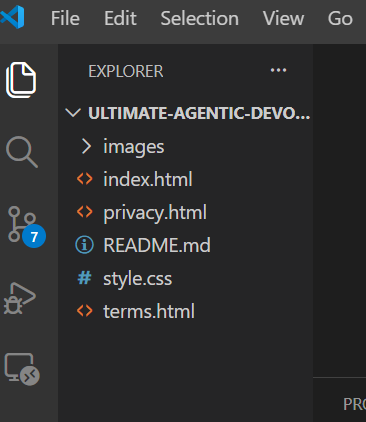
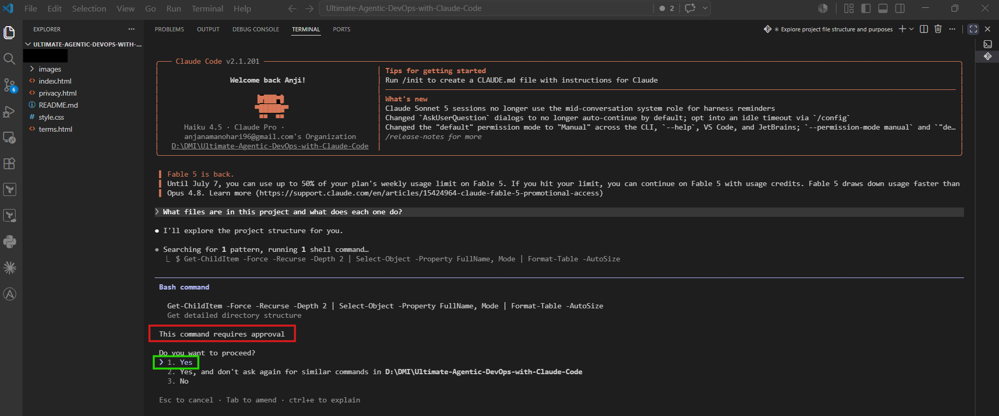

# Assignment 1 — Your First Agentic Session

## 1. Prerequisites Checklist

Before you begin, ensure you have the following:

* Node.js installed

### Install Node.js

1. Open the official Node.js website:[official site](https://nodejs.org/)


2. Go to the Download tab.


3. Navigate to "get a prebuilt Node.js®" section


4. Select your operating system (it is usually selected automatically).


5. Select your architecture (it is usually selected automatically).


6. Select the installer. The download will begin automatically.


7. Go to your Downloads folder and locate the installer.


8. Double-click the installer to start the installation.

9. In the popup window, click Next.


10. Accept the terms and click 'Next'


11. Click 'Next' - Change the destination folder if needed


12. Click 'Next'


13. Check the box and click 'Next'


14. Click 'install' and wait for the installation to complete.


15. Click on 'Finish'


16. A terminal window will open. Press any key to continue (for example, K).


18. If you are using Windows, PowerShell will open with administrator privileges.


19. The required setup will run automatically. When prompted with "Type Enter to exit", press Enter.


20. Open your git bash terminal:


21. Run the following command to verify your Node.js installation.

```bash
node --version
```


---

* Git installed 

Run 

```bash 
git --version
```


### Git installation & setup guide: [git installation](../../onboarding/02-install-git.md)

---

* VS Code installed

Run 

```bash 
code --version
```


### VS Code installation & setup guide: [VS Code installation](../../onboarding/03-install-vscode-and-github-setup.md)

---

* GitHub account ready

### GitHub account creation & setup guide: [GitHub](../../onboarding/01-create-github-account.md)

---

* Claude Pro subscription or 5$ subscription is active

If any of these are missing, install them before proceeding.

---

## 2. Step-by-Step Solution

---

### Step 1 — Install Claude Code CLI

* Open your terminal and run:

```bash
npm install -g @anthropic-ai/claude-code
```


If you are installing Claude Code for the first time, your output may look slightly different. That's completely normal. As long as the installation completes successfully and claude --version returns a version number, you're ready to continue.

---

* Verify installation:

```bash
claude --version
```


---

Expected output:

* A version number is displayed (e.g., `1.x.x`)

---

### Step 2 — Start Claude Code and authorize it.

* For the steps below, use the arrow keys to navigate through the available options.

1. Open your terminal and run:

```bash
claude
```


You will see a screen similar to the one below. Press Enter.

2. Choose your preferred mode and press Enter.


3. Select the appropriate login option based on your subscription plan.(Here, Pro plan is selected, For 5$ setup - Select the second option)


3. Your browser will open automatically. If it doesn't, Claude will provide a link that you can copy and paste into your browser.


4. If you're prompted to add payment details, complete that step first. Once finished, you'll see the authorization screen below.


5. An authentication code will be displayed. Copy it.


6. Return to the Claude Code terminal and paste the authentication code.


7. You should see a screen similar to the one below.


---

### Step 3 — Fork the Starter Repository

1. Login to your GitHub account


2. Open this link [Click here](https://github.com/pravinmishraaws/Ultimate-Agentic-DevOps-with-Claude-Code)

Output window:


2. Click on 'Fork' button


3. Keep the default settings and click on 'Create Fork'


* Wait for the original repository to be copied to your GitHub account.

4. Verify that the repository has been forked to your GitHub account.


---

### Step 4 — Clone Your Fork

1. Click on 'code' button


2. Copy the https link


3. Open your git bash terminal


4. Navigate to the folder you want to clone the repository (as explained in the onboarding guide), then verify your current location.

```bash
cd <folder name>
pwd
```


4. Clone the repository by running:

```bash
git clone <copied url>
```


5. Verify that the repository has been cloned successfully.

```bash
ls
```


6. Navigate to the cloned repository and verify that you're in the correct folder.

```bash
cd Ultimate-Agentic-DevOps-with-Claude-Code/
pwd
```


7. Open the folder in VS Code. If this method doesn't work, use one of the alternative methods described in the onboarding guide.[onboarding](../../onboarding/04-assignment-submission-guide.md) folder

```bash
code .
```


8. Folder opened in VS Code


9. Remove the .claude folder.

* Select the folder, right-click it, and choose Delete.


10. Remove the CLAUDE.md file


11. Remove .github folder


12. Final folder structure after removing the .claude folder, .github folder, and CLAUDE.md.




### Step 4 — Start Claude Code in Project

1. Open terminal in VS Code


2. Select `git bash` terminal (Recommended)


3. Run the following command in the terminal:

```bash
claude
```

* This starts Claude Code in the context of your project.


4. This option is selected automatically. Press Enter.( You may not see this screen and claude code is directly opened in your terminal)


5. Claude Code is now running in your terminal. The selected model is Haiku 4.5.


### Step 5 — Observe Agentic Loop 

#### Run the following prompt in the Claude terminal.

1. Copy and paste the following prompt into the Claude terminal, then press Enter.

```
What files are in this project and what does each one do?
```


2. If Claude requests permission to run commands, select Yes and press Enter.



3. After Claude finishes responding,Maximize the terminal, Click on the highlighted line (You may see something slightly similar to this)


4. You can see the tools it used - your tools can be different from this. 

 <br>


5. Claude's response

 <br>


---

#### Run this second prompt in claude terminal

1. Copy and paste the following prompt into the Claude terminal, then press Enter.

```
How many lines of CSS does this project have?
```


3. After Claude finishes responding,Maximize the terminal, Click on the highlighted line (You may see something slightly similar to this)


3. You can see the tools it used - your tools can be different from this. 


4. Claude's response


---

## 3. Required screenshots

### Screenshot 1 — Terminal showing `claude --version` with the version number visible


### Screenshot 2 — Claude Code authenticated and showing the terminal prompt 


### Screenshot 3 — VS Code with the project open, file tree visible showing `index.html`, `style.css`, `images/`


### Screenshot 4 — Claude's response to the first question, showing it read the files (tool calls visible)

* Screenshots have splitted and taken as they cannot capture in one screenshot

 <br>

 <br>

 <br>

 <br>

### Screenshot 5 — Claude's response to the second question, showing it ran a command and reported the line count


