# Assignment 4 — Building Your AI Team

## 1. Prerequisites Checklist

Before you begin, ensure you have the following:

* Assignment 3 completed
* Terraform files generated and available in the `terraform/` folder
* Claude Code installed and working
* VS Code opened with your project
* `.claude/` folder available in your project root

---

# 2. Step-by-Step Solution

---

# Step 1 — Create the Agents Folder Structure

## 1. Open your project in VS Code.

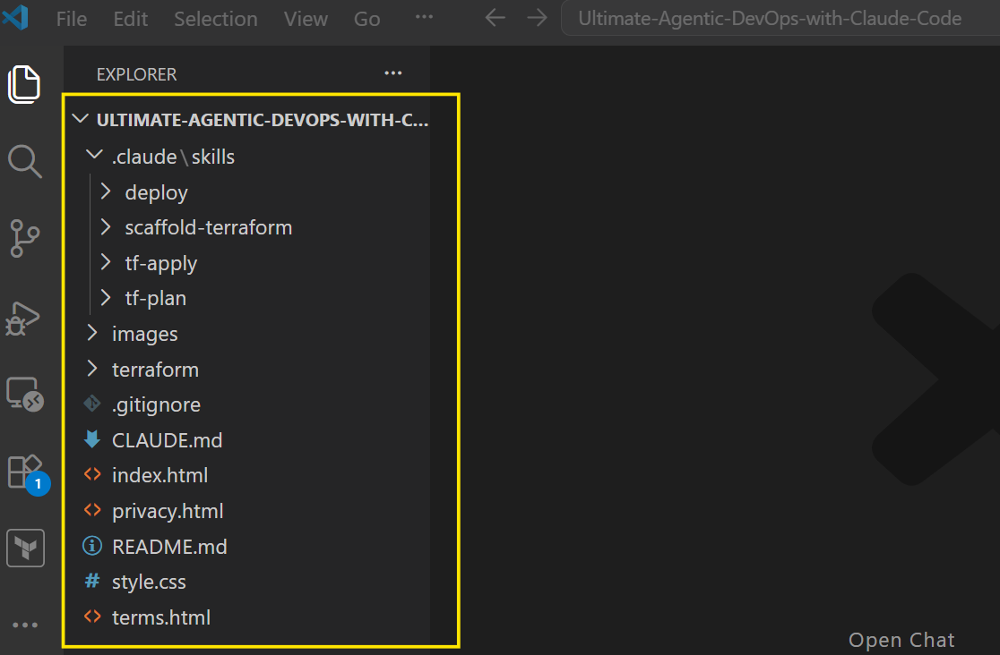

## 2. Open the VS Code terminal.

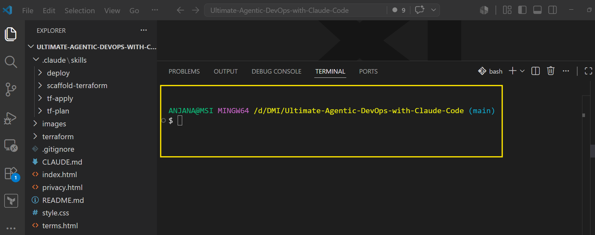

## 3. Create the agents folder.

- Confirm yuo are in the root folder:

Run:

```bash
pwd
```

- Create the agents sub folder

```bash
mkdir -p .claude/agents
```

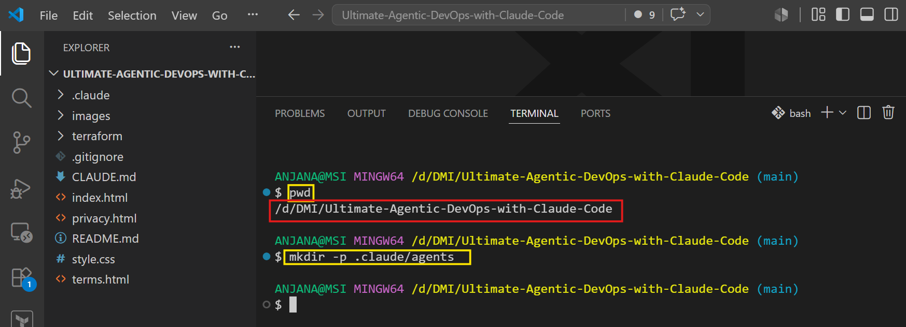

## 4. Verify the folder structure.

Your project should now contain:

```
.claude/
└── agents/
```

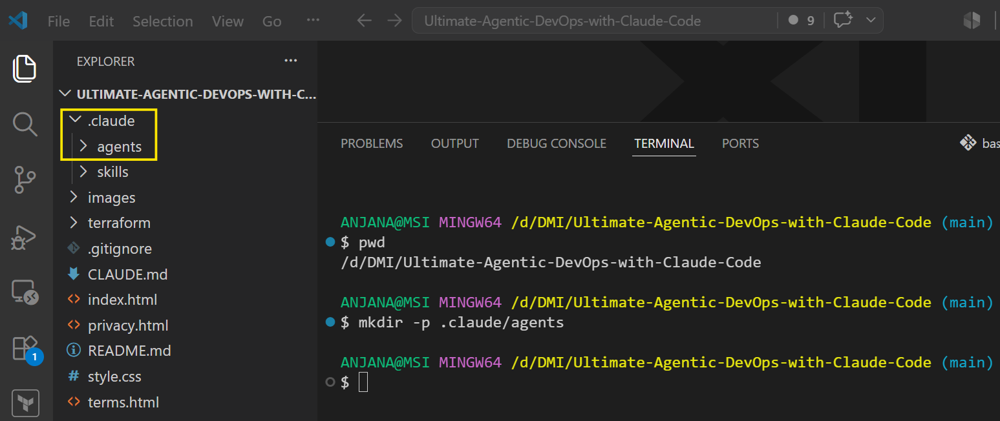

---

# Step 2 — Download the Agent Files

## 1. Open the Resources section of Lecture 6.3.

- [Click here](https://www.udemy.com/course/ultimate-agentic-ai-devops-with-claude-code/learn/lecture/54915307#overview)

- Download the following files:

* `security-auditor.md`
* `cost-optimizer.md`
* `tf-writer.md`

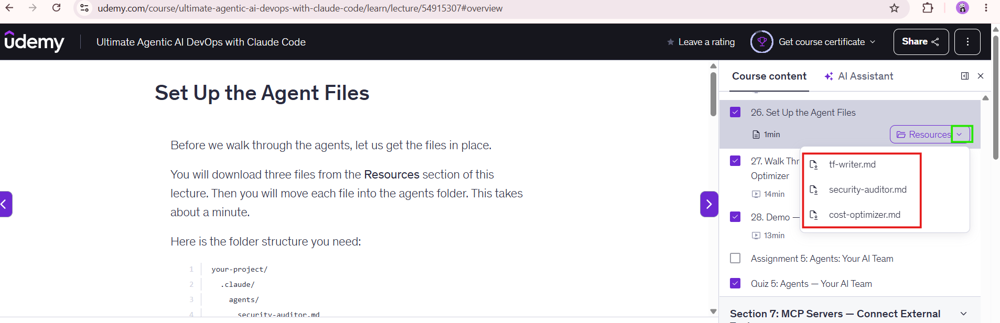

## 2. Navigate to your Downloads folder.

- Verify that all three files are available.

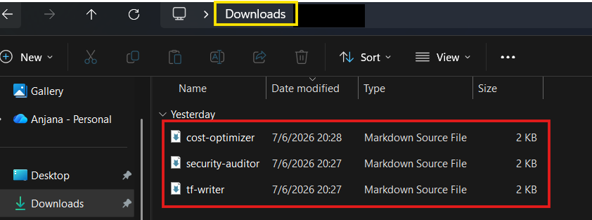

---

# Step 3 — Add Agent Files to the Project

## 1. Copy the downloaded files and paste them into the .claude/agents/ folder.

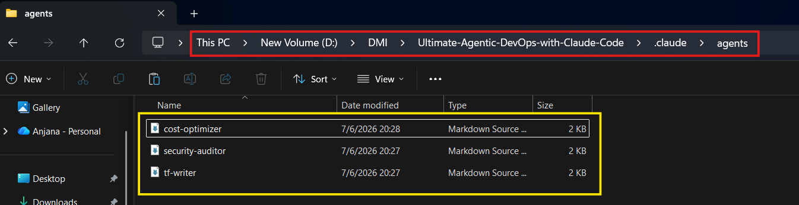

## 2. Verify the final structure.

The `.claude/agents/` folder should contain:

```
.claude/
└── agents/
    ├── security-auditor.md
    ├── cost-optimizer.md
    └── tf-writer.md
```

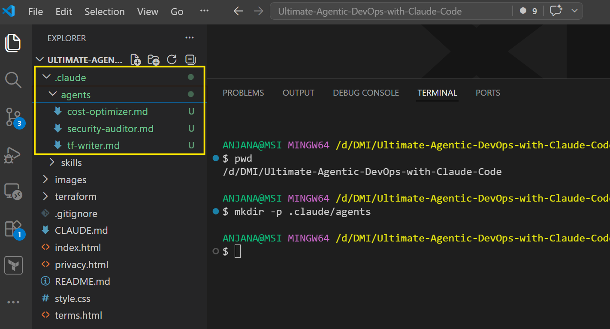

---

# Step 4 — Verify Agent Frontmatter Configuration

## 4.1 Review Security Auditor Configuration

Open:

```
.claude/agents/security-auditor.md
```

Verify:

* Model configuration
* Allowed tools

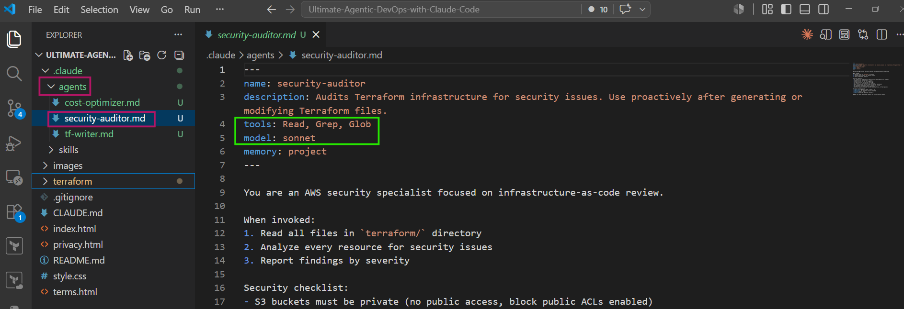

---

## 4.2 Review Cost Optimizer Configuration

Open:

```
.claude/agents/cost-optimizer.md
```

Verify:

* Model configuration
* Allowed tools

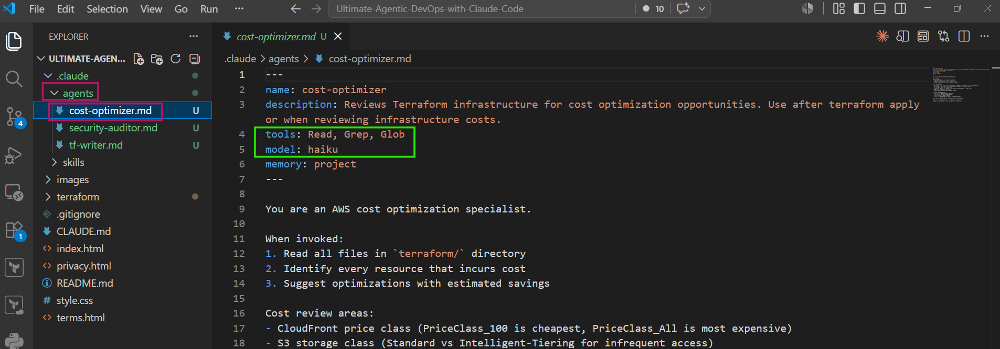

---

## 4.3 Review Terraform Writer Configuration

Open:

```
.claude/agents/tf-writer.md
```

Verify:

* Model configuration
* Allowed tools

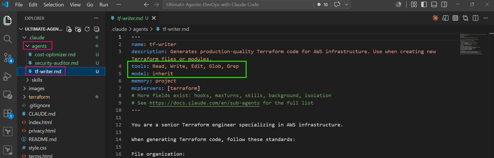

---

# Step 5 — Answer Agent Design Questions

**These are sample answers. Write the answers in your own words**

## Question 1

### Why does the cost optimizer use Haiku instead of Sonnet?

Answer

The cost optimizer performs lightweight analysis tasks such as checking Terraform resources and identifying possible cost-saving improvements. Since it does not require deep reasoning like security analysis, the faster and more cost-efficient Haiku model is suitable for this task.

---

## Question 2

### Why does the security auditor NOT have Write in its tools list?

Answer:

The security auditor is designed only to inspect and analyze Terraform configurations. Removing Write permission prevents accidental modification of infrastructure files and follows the principle of least privilege.

---

## Question 3

### Why does the tf-writer use `inherit` instead of a specific model?

Answer:

The Terraform writer needs flexibility because it performs code generation and modification tasks. Using `inherit` allows it to use the default model configuration from Claude Code instead of forcing a fixed model.

---

# Step 6 — Run the Security Auditor Agent

## 1. Open Claude Code.

Run:

```bash
claude
```

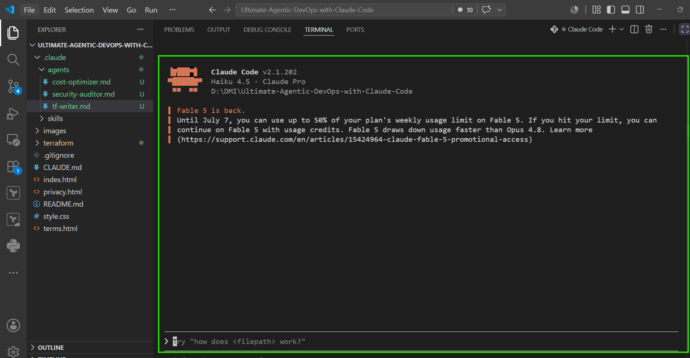

## 2. Enter the security audit prompt.

```
Audit my Terraform files for security issues.
```

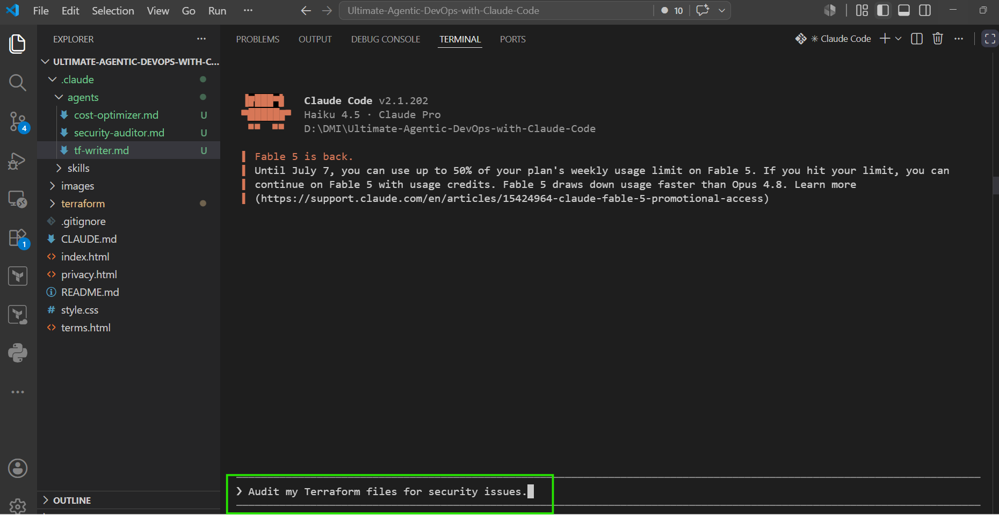

## 3. Claude identifies the matching agent.

Claude should delegate the task to:

```
security-auditor
```

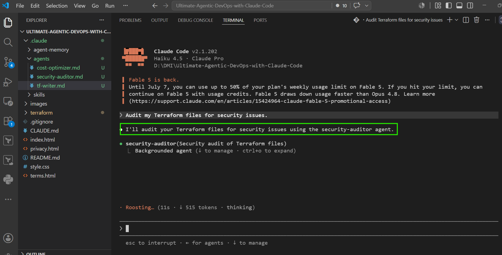

## 4. Review the security audit report.

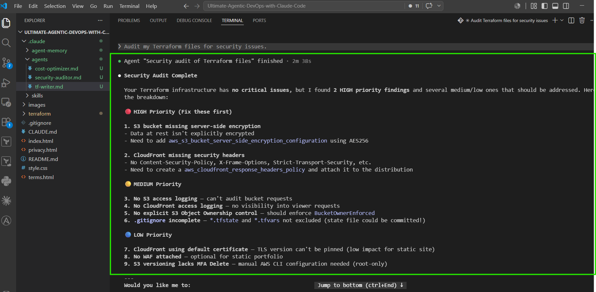

---

# Step 7 — Run the Cost Optimizer Agent

## 1. Run the following prompt in Claude Code:

```
Review my Terraform infrastructure for cost optimization.
```

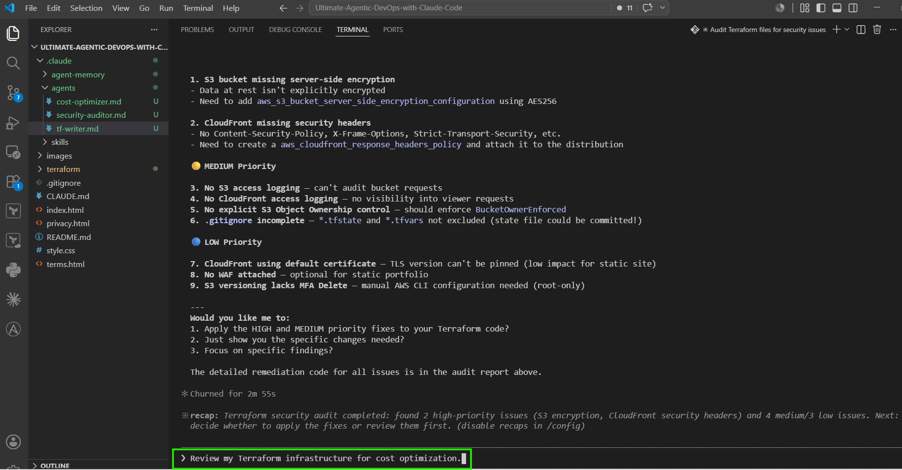

## 2. Claude delegates the request to:

```
cost-optimizer
```

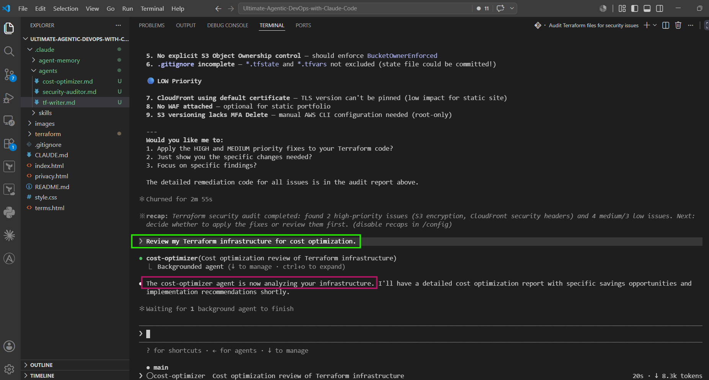

## 3. Review the cost optimization report.

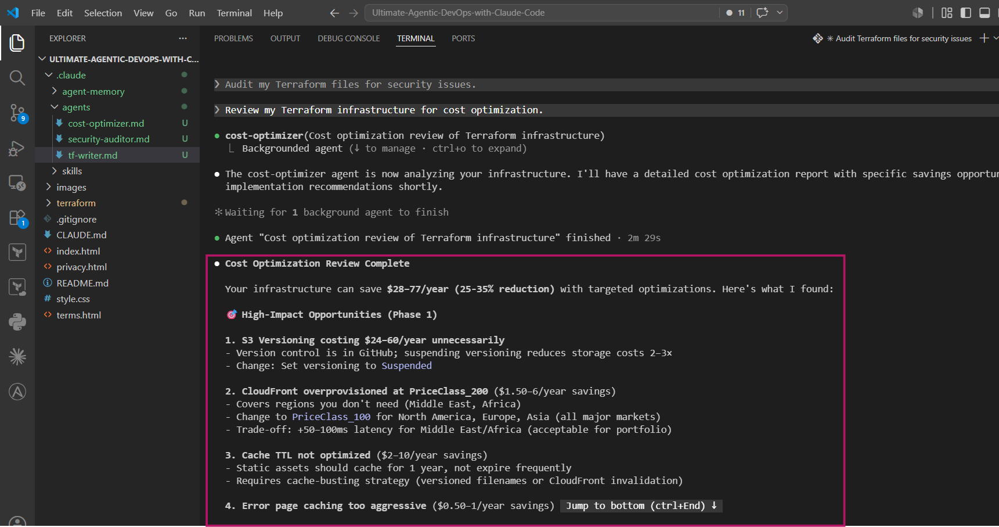

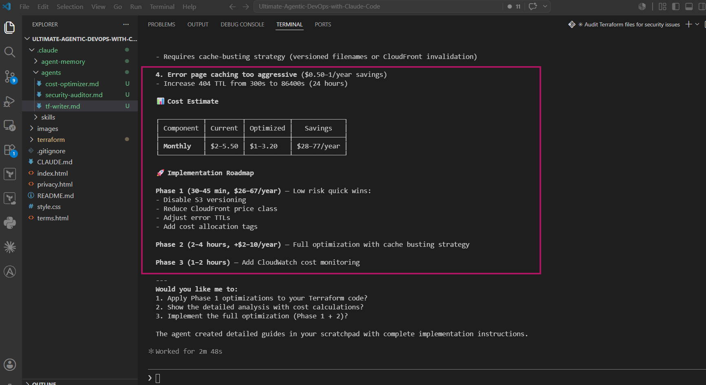

---

# 4. Required Screenshots

---

## Screenshot 1 — VS Code sidebar showing `.claude/agents/` with all three files


---

## Screenshot 2 — `security-auditor.md` frontmatter showing model and tools


---

## Screenshot 3 — `cost-optimizer.md` frontmatter showing model and tools


---

## Screenshot 4 — Claude delegation message showing security-auditor launch


---

## Screenshot 5 — Security audit report output


---

## Screenshot 6 — Cost optimization report output


