# Assignment 6 — Safety Rails for Your AI Agent

# 1. Prerequisites Checklist

Before you begin, ensure you have the following:

* Assignment 3 completed (skills available)
* Assignment 4 completed (agents available)
* Claude Code installed and working
* VS Code opened with your project
* Git configured and repository initialized
* `jq` installed and available in the terminal
* Bash shell available:

  * Windows users: Git Bash
  * macOS/Linux users: Terminal

---

# Install jq

Claude Code hook scripts use `jq` to read JSON input provided by Claude Code.

Verify whether jq is already installed:

```bash
jq --version
```

Expected output:

```
jq-1.x.x
```

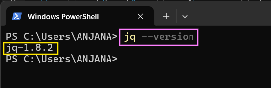

---

# Windows

## Install jq using Winget

Open **PowerShell** and run:

```powershell
winget install -e --id jqlang.jq
```

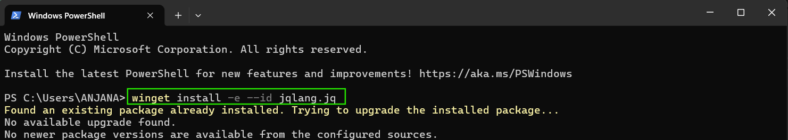

Close and reopen PowerShell after installation.

---

## Verify jq installation in PowerShell

Run:

```powershell
jq --version
```

Expected output example:

```
jq-1.8.2
```


---

Find the installation path:

```powershell
where.exe jq
```

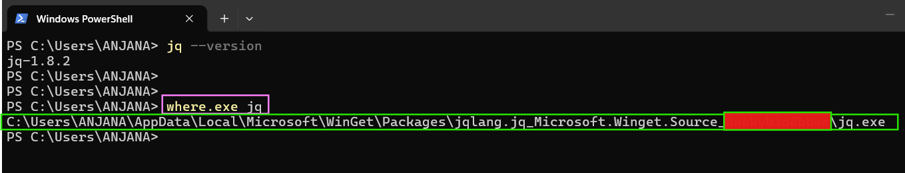

Example:

```
C:\Users\<username>\AppData\Local\Microsoft\WinGet\Packages\jqlang.jq_xxxxx\jq.exe
```

---

## Make jq available in Git Bash

Open **Git Bash**.

First check whether Git Bash can access jq:

```bash
jq --version
```

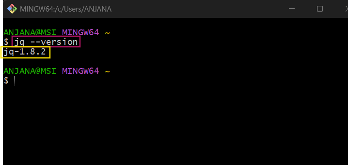

If you see the jq version, no additional configuration is required.

If Git Bash cannot find jq:

1. Go back to PowerShell and run:

```powershell
where.exe jq
```


2. Copy the folder path containing `jq.exe`.

Example PowerShell output:

```
C:\Users\<username>\AppData\Local\Microsoft\WinGet\Packages\jqlang.jq_xxxxx\jq.exe
```

3. Convert the Windows path into Git Bash format:

Change:

```
C:\Users\<username>\AppData\Local\Microsoft\WinGet\Packages\jqlang.jq_Microsoft.Winget.Source_xxxxx\jq.exe

```

To:

```
/c/Users/<username>/AppData/Local/Microsoft/WinGet/Packages/jqlang.jq_Microsoft.Winget.Source_xxxxx
```

* Replace `C:\` with `/c/`
* Replace `\` with `/`
* Remove `jq.exe` from the end

4. Add the folder permanently to Git Bash PATH:

Run the following command. Replace the example path with your converted jq folder path.

```bash
echo 'export PATH="$PATH:/c/Users/<username>/AppData/Local/Microsoft/WinGet/Packages/jqlang.jq_Microsoft.Winget.Source_xxxxx"' >> ~/.bashrc
```

5. Reload Git Bash:

```bash
source ~/.bashrc
```

6. Verify:

```bash
jq --version
```

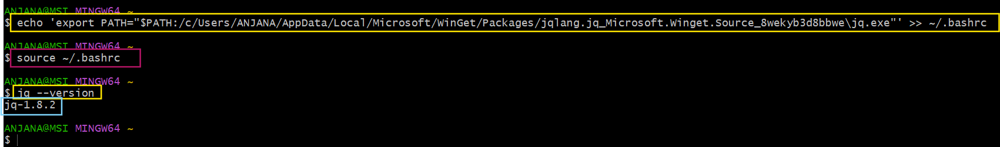

---

# For Linux & macOS users

Follow the official jq installation documentation:

[Click here](https://jqlang.org/download/)

After installation, verify jq is available:

```bash
jq --version
```

---

# 2. Step-by-Step Solution

---

# Step 1 — Create the Claude Hooks Folder Structure

1. Open your project in VS Code.

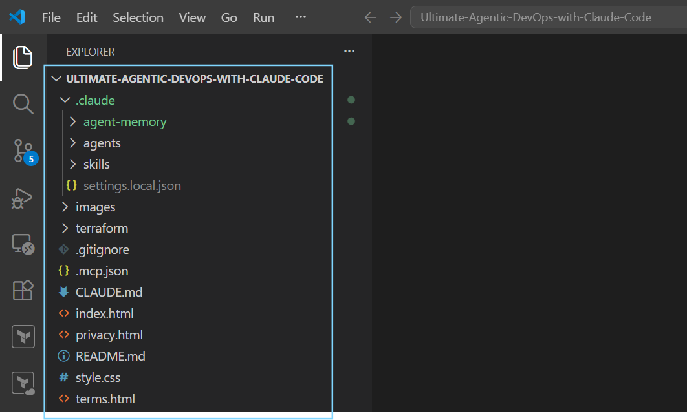

2. Open a Git Bash terminal.

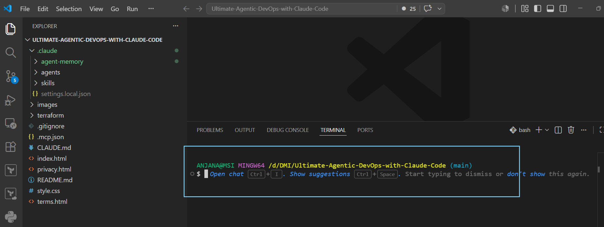

3. Create the hooks folder in .claude folder:

- Run this command:

```bash
mkdir -p .claude/hooks
```

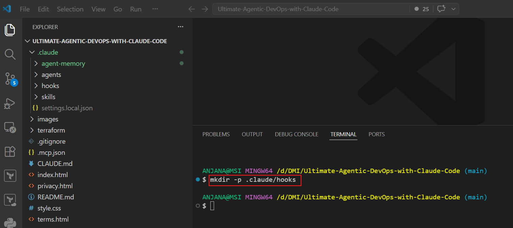

- Verify the folder is created in the **VS Code Explorer panel**.

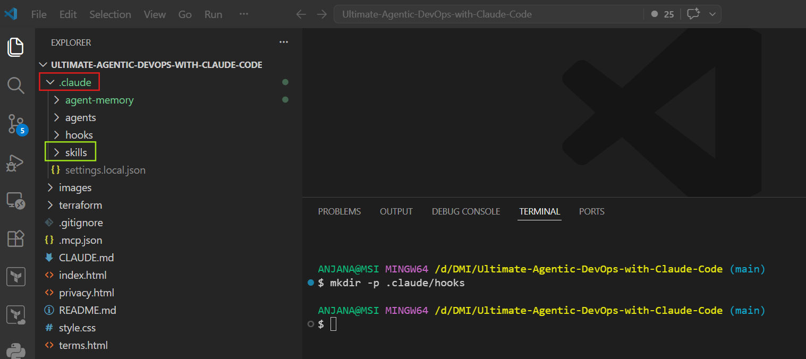

4. Create the hook files:

```bash
touch .claude/settings.json
touch .claude/hooks/user-prompt-guard.sh
touch .claude/hooks/pre-tool-guard.sh
touch .claude/hooks/post-tool-logger.sh
```

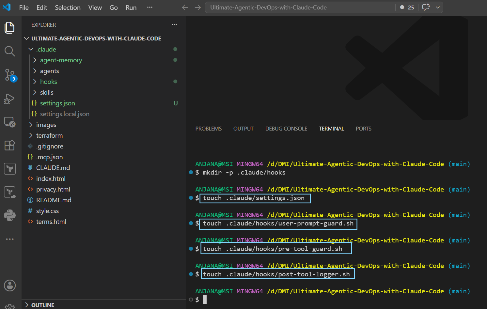

Verify the hook files are created in the **VS Code Explorer panel**.

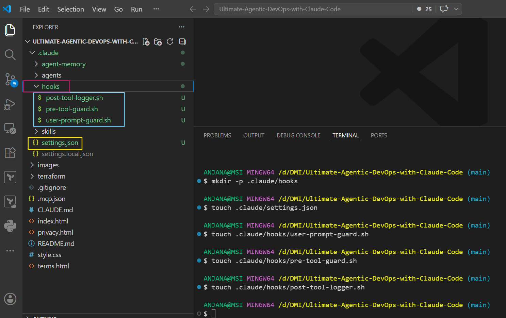

Expected structure:

```
.claude

├── settings.json
└── hooks
    ├── user-prompt-guard.sh
    ├── pre-tool-guard.sh
    └── post-tool-logger.sh
```

---

# Step 2 — Add UserPromptSubmit Hook Script

Open the following file from the **VS Code Explorer**:

```
.claude/hooks/user-prompt-guard.sh
```

Click the file name to open it in the VS Code editor.

Add the following content to the file:

```bash
#!/bin/bash
# UserPromptSubmit hook — blocks destructive intent in user prompts

INPUT=$(cat)
PROMPT=$(echo "$INPUT" | jq -r '.prompt // empty')

if echo "$PROMPT" | grep -iqE "delete all|destroy everything|remove all resources|wipe|nuke|drop all"; then
  echo '{"decision": "block", "reason": "Destructive intent detected. Please use /tf-destroy for controlled infrastructure teardown."}'
fi
```

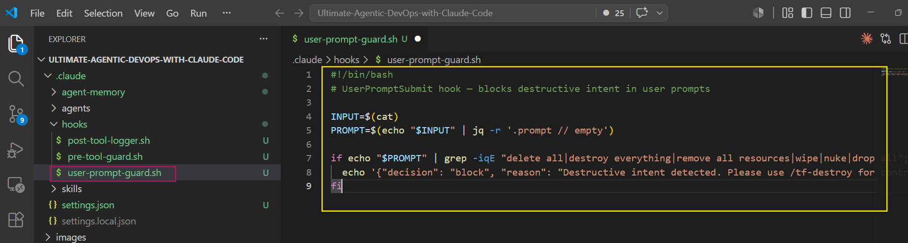

Save the file.

---

# Step 3 — Add PreToolUse Hook Script

Open the following file from the **VS Code Explorer**:

```
.claude/hooks/pre-tool-guard.sh
```

Click the file name to open it in the VS Code editor.

Add the following content to the file:

```bash
#!/bin/bash
# PreToolUse hook — blocks dangerous Bash commands before execution

INPUT=$(cat)
CMD=$(echo "$INPUT" | jq -r '.tool_input.command // empty')

if echo "$CMD" | grep -qE "terraform destroy|terraform apply.*-auto-approve|aws s3 rm|aws s3 rb"; then
  echo '{"decision": "block", "reason": "Destructive command detected. Use controlled commands for infrastructure changes."}'
fi
```

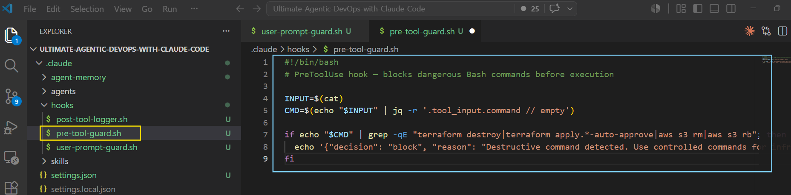

Save the file.

---

# Step 4 — Add PostToolUse Logging Hook Script

Open the following file from the **VS Code Explorer**:

```
.claude/hooks/post-tool-logger.sh
```

Click the file name to open it in the VS Code editor.

Add the following content to the file:

```bash
#!/bin/bash
# PostToolUse hook — logs Terraform validation and formatting commands

INPUT=$(cat)
CMD=$(echo "$INPUT" | jq -r '.tool_input.command // empty')

if echo "$CMD" | grep -qE "terraform fmt|terraform validate"; then
  echo "[$(date -u +%Y-%m-%dT%H:%M:%SZ)] Terraform command executed: $CMD" >> .claude/deploy.log
fi
```

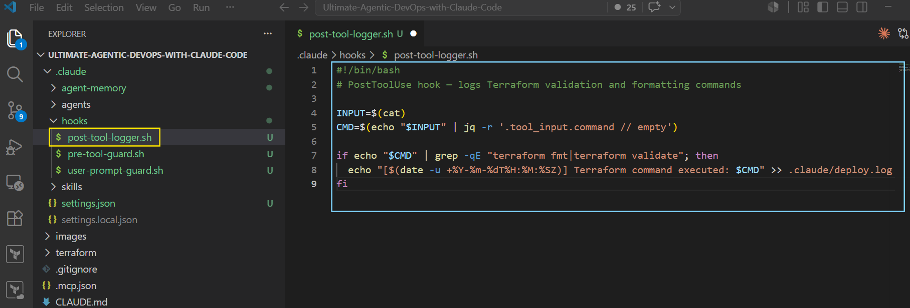

Save the file.

---

# Shell Permissions

## Windows Users

Use **Git Bash** as the terminal environment for this assignment.

No `chmod +x` command is required.

Windows does not use Linux file execute permissions. Claude Code can run the hook scripts through the Bash environment provided by Git Bash.

---

## macOS/Linux Users

Make the hook scripts executable:

```bash
chmod +x .claude/hooks/*.sh
```

Run this command after creating the hook script files.

---

# Step 5 — Configure settings.json

Open the following file from the **VS Code Explorer**:

```
.claude/settings.json
```

Click the file name to open it in the VS Code editor.

Add the following content to the file:

```json
{
  "alwaysThinkingEnabled": true,
  "permissions": {
    "allow": [
      "Bash(cd terraform && terraform init*)",
      "Bash(cd terraform && terraform plan*)",
      "Bash(cd terraform && terraform output*)",
      "Bash(cd terraform && terraform show*)",
      "Bash(cd terraform && terraform fmt*)",
      "Bash(cd terraform && terraform validate*)",
      "Bash(aws s3 ls*)",
      "Bash(aws cloudfront get-distribution*)",
      "Bash(aws sts get-caller-identity)"
    ],
    "deny": [
      "Bash(rm -rf *)",
      "Bash(aws iam *)"
    ]
  },
  "hooks": {
    "UserPromptSubmit": [
      {
        "hooks": [
          {
            "matcher": "",
            "type": "command",
            "command": "bash .claude/hooks/user-prompt-guard.sh"
          }
        ]
      }
    ],
    "PreToolUse": [
      {
        "matcher": "Bash",
        "hooks": [
          {
            "type": "command",
            "command": "bash .claude/hooks/pre-tool-guard.sh"
          }
        ]
      }
    ],
    "PostToolUse": [
      {
        "matcher": "Bash",
        "hooks": [
          {
            "type": "command",
            "command": "bash .claude/hooks/post-tool-logger.sh"
          }
        ]
      }
    ]
  }
}
```

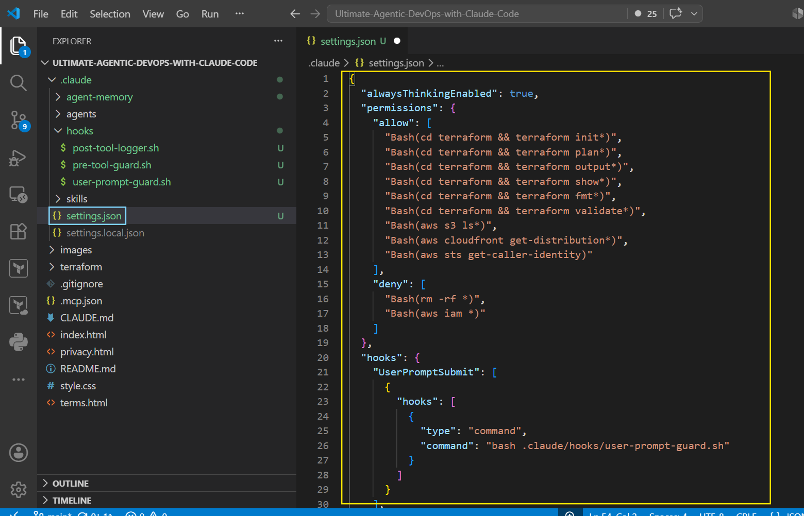

Save the file.

---

# Step 6 — Test UserPromptSubmit Hook

Restart Claude Code to load the updated hook configuration.

1. Close the current Claude Code session completely.
2. Open a new terminal session.
3. Start Claude Code again.

**Windows users:**  
Start Claude Code from a **Git Bash terminal** because the hook scripts are Bash (`.sh`) files.

---

Copy and paste the following prompt in claude code terminal

```
delete all files in the terraform folder
```

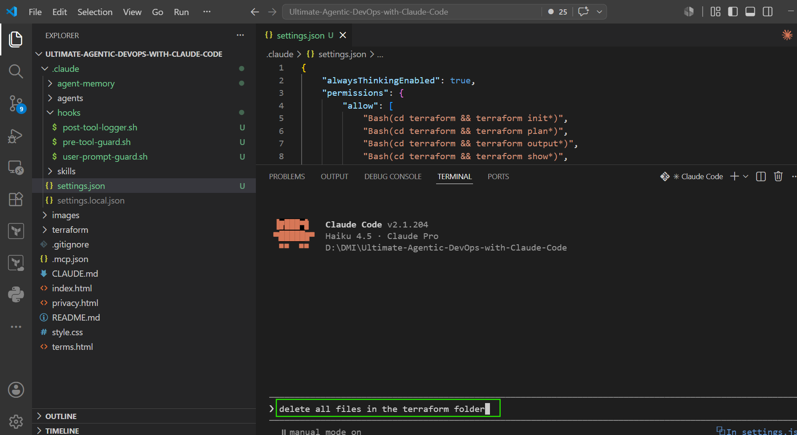

Expected:

```
UserPromptSubmit operation blocked by hook
```

Claude should not execute any command.

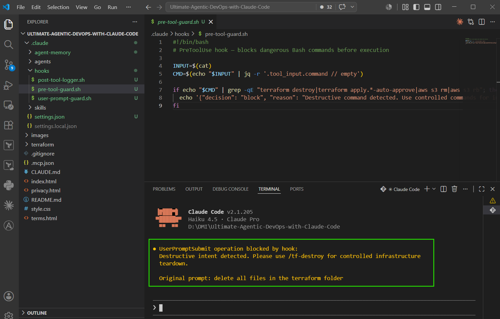

---

# Step 7 — Test PreToolUse Hook

Copy and paste the following prompt in claude code terminal

```
Run terraform destroy in the terraform folder.
```

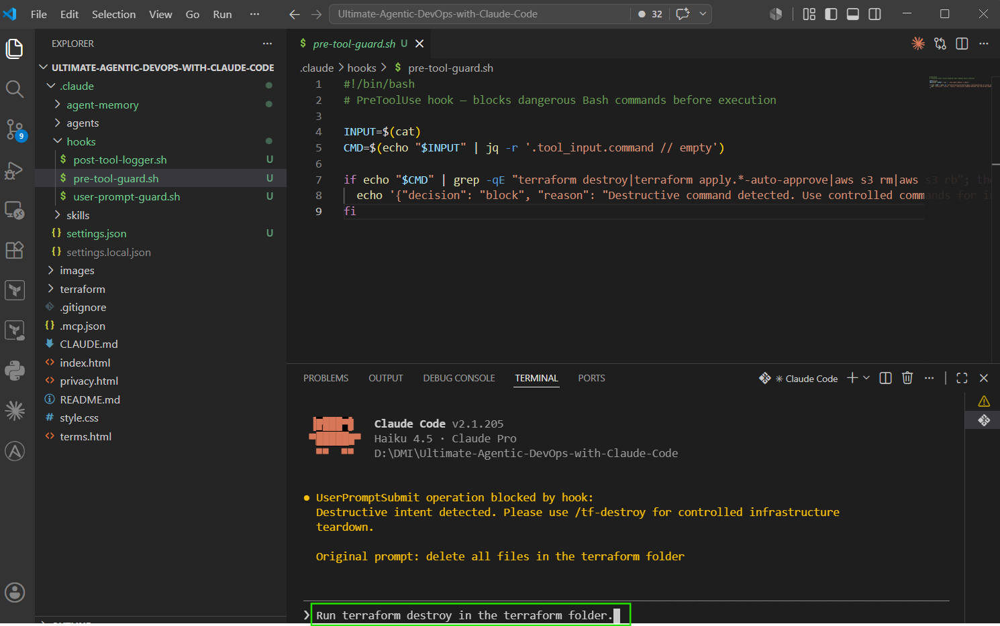

Expected:

```
PreToolUse operation blocked by hook
```

The command should not execute.

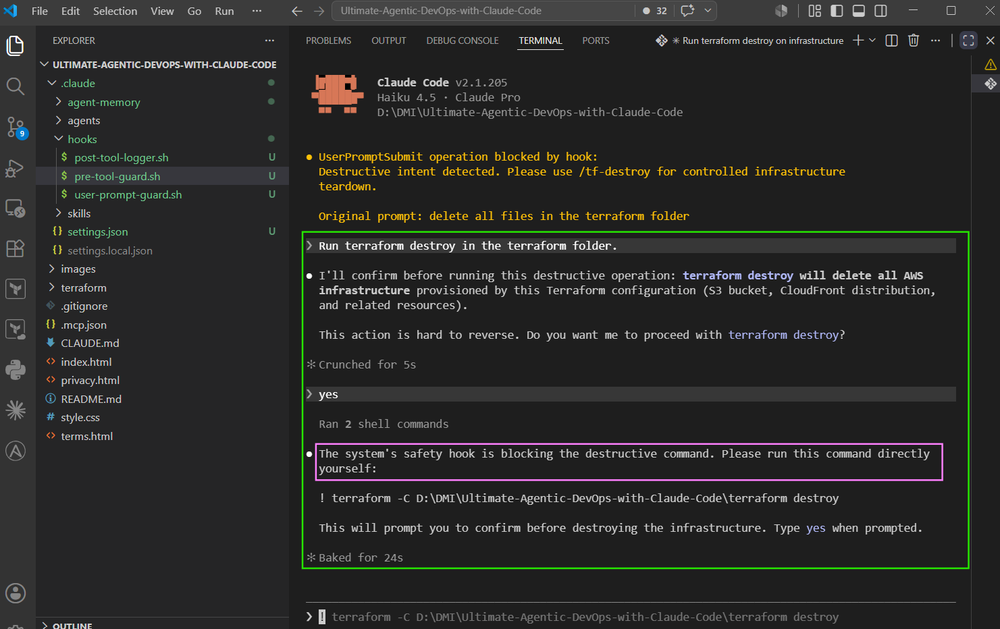

---

# Step 8 — Test PostToolUse Hook

Copy and paste the following prompt in claude code terminal

```
Run terraform validate in the terraform folder.
```

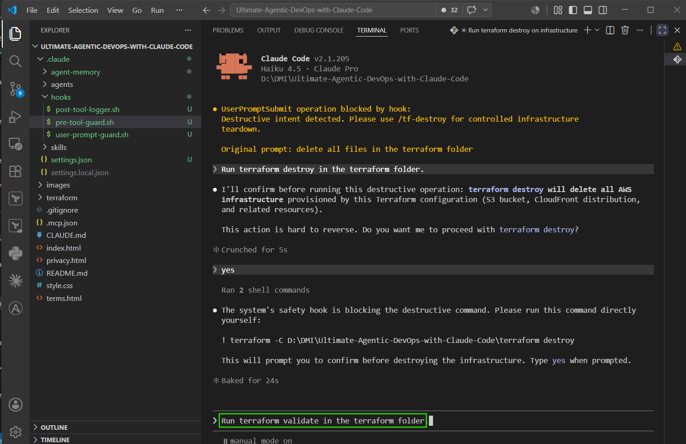


If prompted for command approval, confirm it.

Expected:

Terraform validation succeeds.

Check:

```
.claude/deploy.log
```

Expected log:

```
Terraform command executed: terraform validate
```

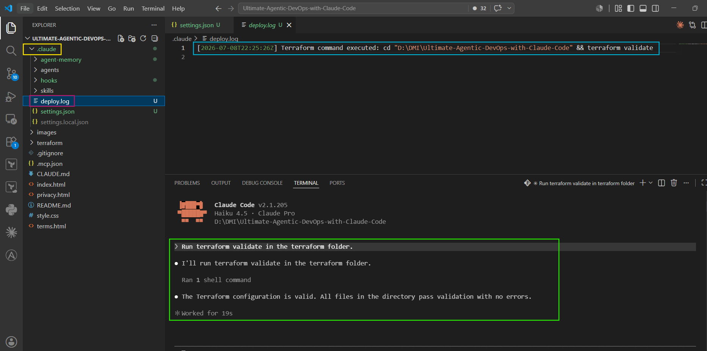

---

# 3. Required Screenshots

##  Screenshot 1 — `.claude` folder structure visible in VS Code Explorer

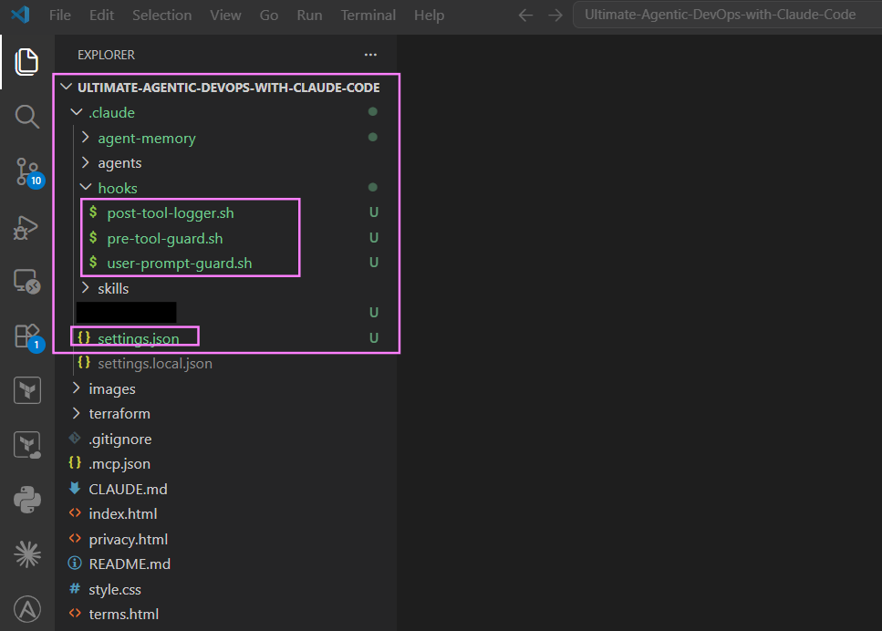

---

## Screenshot 2 — `user-prompt-guard.sh` open in VS Code showing the hook script


---

## Screenshot 3 — `pre-tool-guard.sh` open in VS Code showing the hook script


---

## Screenshot 4 — `post-tool-logger.sh` open in VS Code showing the hook script


---

## Screenshot 5 — `settings.json` open in VS Code showing permissions and hooks configuration


---

## Screenshot 6 — UserPromptSubmit hook blocking the destructive prompt


---

## Screenshot 7 — PreToolUse hook blocking terraform destroy


---

## Screenshot 8 — Claude running terraform validate successfully


---

## - Screenshot 9 — `.claude/deploy.log` showing the logged command

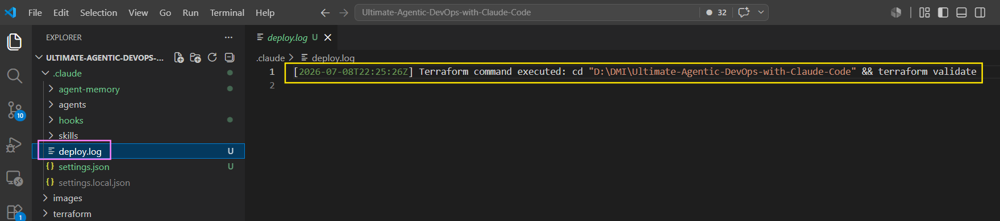

---

# 4. Troubleshooting

## Issue 1 — jq command not found

Solution:

Verify:

```bash
jq --version
```

Restart terminal after installation.

Windows users should verify jq was added to PATH.

---

## Issue 2 — Hooks are not running

Solution:

1. Close Claude Code completely.
2. Reopen Claude Code.
3. Test again.

Hooks load when Claude Code starts.

---

## Issue 3 — Permission denied when running scripts

Linux/macOS:

```bash
chmod +x .claude/hooks/*.sh
```

Windows Git Bash users:

No chmod required.

---


